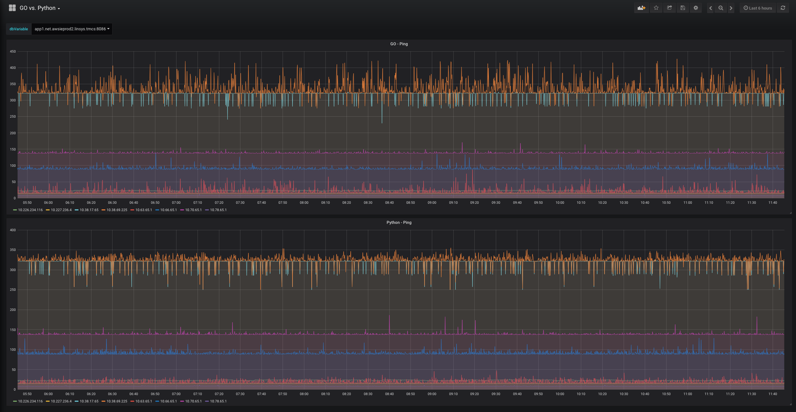

Network Telemetry based on ping probes written in GO language. Goroutine is used to run probes in multi-thread as well as to write data in 2 ore more databases at the same time.

All other info available at: https://gitlab.com/networkAutomation/network-telemetry/blob/master/README.md

### GO vs. Python

